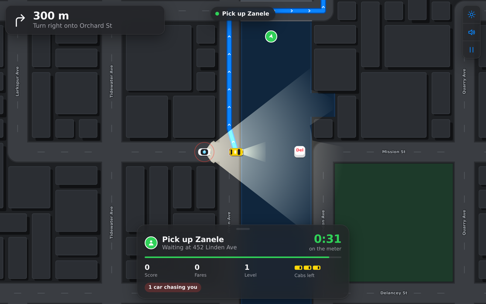
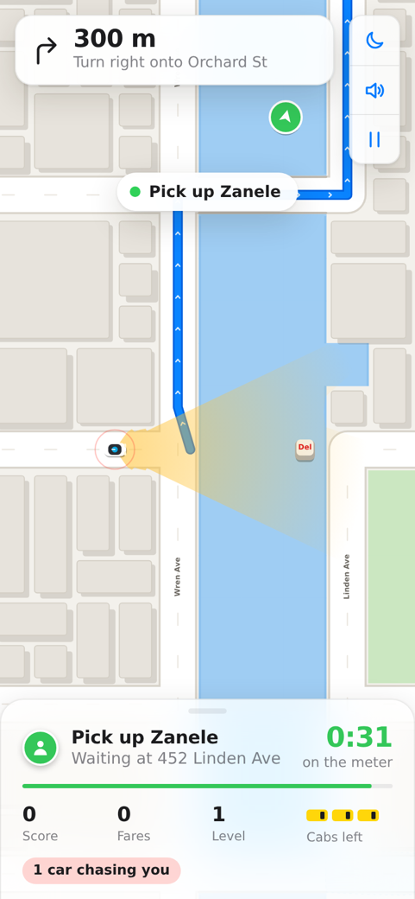

# Ctrl+Alt+Drive

You're the last human cab in a city of robotaxis. Get every fare there before the self-driving fleet gets you.

A top-down chase game in the spirit of Pac-Man, dressed as a navigation app. Pick a city, drive its signature cab, follow the blue route to your passenger, and stay out of the headlights of the self-driving cars patrolling the streets.

**[Play it](https://vertigovx.github.io/ctrl-alt-drive/)**



<p align="center"></p>

## How to play

| Action | Keys |
|---|---|
| Drive | <kbd>W</kbd> <kbd>A</kbd> <kbd>S</kbd> <kbd>D</kbd> or arrow keys. On a phone, touch and drag anywhere; the cab drives towards your thumb. |
| Start | <kbd>Enter</kbd> on the title screen |
| Pause | <kbd>P</kbd> or <kbd>Esc</kbd> |
| Horn | <kbd>H</kbd>, or the horn button on a phone |
| Cycle map style | <kbd>T</kbd> |
| Sound | <kbd>M</kbd> |

Steering has one-tap presets (Gentle, Standard, Sharp) on the title screen, and a fine-grained slider in **Settings**, which is also reachable mid-shift from the gear button.

- **Fares.** Pick up at the green pin, drop off at the red one. The meter covers the whole trip, and whatever time is left when you arrive is paid as a bonus. Let it run out and the passenger calls a robotaxi instead.
- **The fleet.** Self-driving cars cruise with their lidar sweeping ahead. The moment one sees you, its headlights flash on and it gives chase. Break its line of sight (buildings block it; water and parks don't) and it searches where it last saw you before giving up.
- **Getting caught** costs you a cab and the passenger. Lose three cabs and the shift is over.
- **Power-ups** appear as keycaps on the road. <kbd>Del</kbd> reboots the whole fleet for a few seconds, and you can ram rebooting cars off the road for points. The lightning key is a Surge: extra top speed for four seconds.
- **Levels.** Every two fares, more cars join the fleet and they get faster.
- **Modes.** *Normal* is three cabs, and crashes only dent your pride (and your tips). *Hard* is two cabs: wreck one and it's gone, the fleet is faster, and it pays 1.5×. *Extreme* is two cabs with heavier crash damage that carries over when you're caught, and pays 2×.
- **Cab condition.** Real crashes (not kerb scrapes) dent the cab. Finish a fare in mint condition for a chance of a tip, or a perk dropped nearby. A wrench key on the road repairs damage.
- **Passengers.** Some are in a hurry (tight meter, better pay), some are sightseeing (relaxed meter), and business travellers tip well. Very rarely a VIP flags you down, shown by a gold pin: Shingai, Mark, Tiago or Denisha. VIPs pay double.
- **The garage.** Every fare you complete is banked in your wallet, even if the shift ends badly. Spend it on paint jobs, roof lights, horns and map styles (Vintage, Blueprint, Neon Noir). Everything in the garage is cosmetic: nothing you buy makes the game easier. Your wallet and garage are saved in your browser.

### Cities

| City | Your cab | Landmarks |
|---|---|---|
| New York | Yellow cab | Central Park, Empire State Building |
| London | Black cab | Elizabeth Tower, the London Eye |
| Hong Kong | Red taxi | Harbour tower, temple garden |
| Cape Town | Minibus taxi | Table Mountain, the stadium |
| Sydney | Harbour taxi | Opera House, botanic garden |
| Singapore | Blue taxi | Bayfront towers, the Merlion |
| Paris | Taxi parisien | Eiffel Tower, Arc de Triomphe |
| Tokyo | Tokyo taxi (and JDM-style robotaxis) | Shibuya Crossing, Shinjuku towers |

Each city has a fixed, hand-tuned layout you can learn, with local street names and passengers; traffic and fares vary every run. Link straight to one with `?city=tokyo`. The cities stay alive around you: lit windows, street lamps, traffic lights, pedestrians, park trees and boats on the water.

The soundtrack is an original chiptune loop composed as note data and synthesised live with Web Audio. It builds when a robotaxi is on your tail.

## Development

```bash
npm install
npm run dev         # local dev server
npm test            # run the test suite once
npm run test:watch  # TDD loop
npm run coverage    # tests + coverage for src/core
npm run typecheck
npm run build       # production build to dist/
npm run build:single  # one self-contained HTML file in dist-single/
npm run balance     # headless bot playthroughs to sanity-check difficulty
```

Requires Node 20 or newer. Add `?debug` to the URL to expose the live game state as `window.cad` in the console.

### Built test-first

All game logic was written red → green: a failing spec first, then the implementation. The commit history keeps that trail, with `test: …` commits followed by `feat: …` commits. The core has 218 tests at about 98% line coverage.

What makes that practical is a hard split. Everything that decides *what happens* lives in `src/core` as pure, deterministic TypeScript with no DOM access. Randomness comes from a seeded RNG, so a city, a spawn, or an AV's patrol can be reproduced exactly in a test. The renderer and HUD only read game state and draw it.

```
src/
  core/               pure game logic, fully unit-tested
    city.ts           procedural city: street grid, river and bridges, parks, dead-end pruning
    pathfinding.ts    A*, BFS distance fields, turn detection for directions
    vision.ts         line-of-sight ray marching, sight cones, visibility fans
    vehicle.ts        arcade handling: throttle, steering, lane assist, wall sliding
    autonomous.ts     self-driving car state machine
    game.ts           rules: fares, meter, catching, damage, lives, spawner, levels, power-ups
    cities.ts         the eight cities: layouts, landmarks, streets, passengers
    modes.ts          Normal / Hard / Extreme rules
    passengers.ts     passenger types and VIPs
    shop.ts           garage catalogue, wallet, buying/equipping, tamper-safe saves
    settings.ts       player settings (steering sensitivity, sound, map style)
    camera.ts  input.ts  format.ts  math.ts  rng.ts
  render/             canvas renderer, map themes, city cabs, landmarks and ambient life
  ui/                 garage controller, synthesized sound effects and music
  main.ts             game loop, HUD binding, input wiring
tests/                Vitest specs, one file per core module
scripts/balance.ts    difficulty probe
```

### Design notes

**The city is Pac-Man-legal by construction.** The generator lays a street grid, knocks out random segments to make a maze, cuts a river through it with a few bridges, then repeatedly prunes any road tile with fewer than two exits and keeps only the largest connected network. Tests assert those properties across several seeds: one connected network, no dead ends, water stays in its corridor, at least two bridges.

**Self-driving cars run a small state machine:** patrol → alert → chase → search → patrol, plus rebooting from the power-up. The alert beat, where headlights flicker for 0.4 s before the chase begins, is a deliberate fairness window, so you always get a moment to react. Chasing cars replan with A* a few times a second towards where they last saw you, and keep tracking for 0.8 s after losing sight, so ducking round a corner isn't quite enough on its own.

**What you see is what they see.** Headlight cones are drawn from the same ray-marched line of sight the AI uses. A beam cut off by a building means the car genuinely can't see past it.

**Tuned with a bot.** `npm run balance` plays every mode across the cities with a bot that follows the route, brakes for corners and ignores the fleet. On Normal it averages about two and a half fares before losing all three cabs; Hard and Extreme are progressively harsher. Raw driving isn't enough; you have to evade. The same probe set the crash-damage threshold: measuring every wall contact showed that impacts below 90 are almost all kerb scrapes while cornering, so only real crashes dent the cab.

**The garage can't be pay-to-win, by construction.** Shop items carry only an id, a name, a price and a blurb. How each one looks or sounds lives in the render and audio layers, and a test fails if anyone adds a gameplay field to the catalogue. Saves are parsed defensively too: a corrupted or hand-edited save falls back to safe defaults instead of crashing or equipping things you don't own.

**Mobile first-class.** The canvas renders at the device's full pixel density (up to 3×, within a pixel budget) and re-checks its size every frame, so rotating the phone or the browser toolbar sliding away can never leave it stretched. Phones get a closer camera, and the camera frames the taxi in the gap between HUD panels rather than the centre of the screen. On landscape phones the HUD docks down the left side.

**The look borrows a navigation app's grammar:** Apple Maps' day and night palettes, a turn-by-turn banner built from the live route and real street names, a bottom sheet for the fare, and round map controls. The one loud element is the keycap, which appears in the logo, the countdown, and the power-ups on the road.

## Deploying

Pushing to `main` runs the tests and publishes `dist/` to GitHub Pages via `.github/workflows/deploy.yml`. You only need to do one thing: in the repository settings, set **Pages → Build and deployment → Source** to **GitHub Actions**.

## License

MIT
